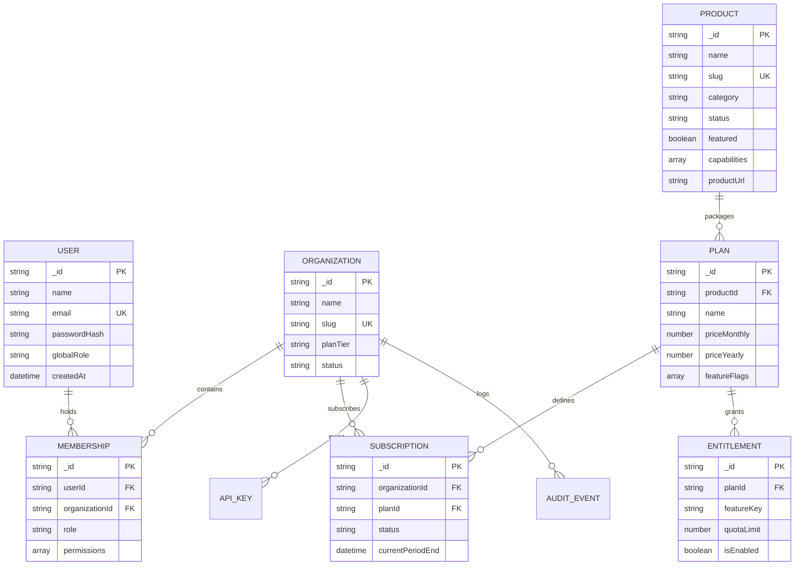

# DEVSAMP SYSTEM DESIGN & ARCHITECTURE DOCUMENTATION

```
==============================================================================
PROJECT: DevSamp Platform & Ecosystem
DOCUMENT: System Design & Architectural Blueprint
VERSION: 2.0.0 (Modular Monolith)
STACK: Next.js 16 (App Router) • JavaScript • Tailwind CSS • MongoDB Atlas
AUTHOR: DevSamp Core Engineering Team
==============================================================================
```

---

## 1. Executive Summary & Brand Direction

**DevSamp** is an integrated **Technology + Software Products + SaaS + Digital Solutions Ecosystem**. 

Rather than functioning as a standard service agency, DevSamp operates across three interconnected pillars:
1. **Software Products & SaaS Platforms**: Proprietary vertical software applications (e.g., *MedERP Pro*, *DevScale Core*, *FlowPulse POS*, *OmniDesk AI*).
2. **Professional Technology Services**: High-concurrency bespoke web systems, Next.js applications, mobile solutions, and cloud DevOps engineering.
3. **Connected Developer Ecosystem**: Unified authentication, open REST APIs, webhooks, modular SDKs, and partner integration mesh.

The architectural goal is to support continuous multi-product scaling while maintaining uncompromising performance, data integrity, and a premium developer experience.

---

## 2. Target Layered Architecture (Modular Monolith)

DevSamp follows a strict **Layered Modular-Monolith** architecture. Domain boundaries are isolated while running within a high-performance Next.js unified deployment.

```mermaid
graph TD
    subgraph Experience_Layer ["1. Experience Layer (Next.js UI & Portals)"]
        UI_Web["Main Ecosystem Website (Marketing / CMS)"]
        UI_Dash["Customer / Client Dashboard (/dashboard)"]
        UI_Admin["Admin Control Plane (/admin)"]
        UI_Dev["Developer Portal & API Docs (/developers)"]
        UI_Apps["Product Applications (/products/*)"]
    end

    subgraph API_Layer ["2. Application & API Gateway (/api/v1 & /api/*)"]
        API_Route["Next.js Route Handlers (Request Parsing, Validation, Context)"]
        API_Std["Standard Envelope: { success, data, meta } / Error Handlers"]
    end

    subgraph Security_Layer ["3. Authentication & RBAC Layer"]
        Auth_Sess["Session Manager (JWT / httpOnly Cookie Engine)"]
        Auth_RBAC["Server-Side RBAC Guard (Roles & Permissions Matrix)"]
        Auth_Tenant["Tenant Isolation Validator (Organization Boundary)"]
    end

    subgraph Domain_Layer ["4. Domain Services Layer (src/server/services/)"]
        Svc_CMS["CMS & Section Service"]
        Svc_Prod["Product & Plan Service"]
        Svc_Org["Organization & Member Service"]
        Svc_Ent["Entitlement Resolution Engine"]
        Svc_Bill["Billing & Webhook Idempotency Service"]
        Svc_Supp["Support & Ticket Service"]
        Svc_Notif["Notification Service (Email, In-App)"]
        Svc_Audit["Audit Log Service"]
    end

    subgraph Repo_Layer ["5. Repository Layer (src/server/repositories/)"]
        Repo_Prod["ProductRepository"]
        Repo_Ecos["EcosystemRepository"]
        Repo_Sec["SectionRepository"]
        Repo_Org["OrganizationRepository"]
        Repo_User["UserRepository"]
        Repo_Sub["SubscriptionRepository"]
    end

    subgraph DB_Layer ["6. Database (MongoDB Atlas)"]
        DB_Mongo[(MongoDB Clustered Database Collections)]
    end

    Experience_Layer --> API_Layer
    API_Layer --> Security_Layer
    Security_Layer --> Domain_Layer
    Domain_Layer --> Repo_Layer
    Repo_Layer --> DB_Layer
```



---

## 3. Layer Responsibilities & Rules of Separation

| Architectural Layer | Core Responsibility | Strict Boundaries (What NOT to do) |
| :--- | :--- | :--- |
| **Experience / UI** | Presentation, visual rendering, micro-interactions, local UI state, responsive layouts. | **NO** direct MongoDB calls, **NO** secrets/API keys, **NO** complex billing math. |
| **API Gateway** | HTTP route handling, request validation, auth context extraction, invoking domain services, returning envelope responses. | **NO** direct database aggregation, **NO** raw business workflows duplicated across routes. |
| **Security & RBAC** | Identity verification, session decryption, tenant membership validation, permission checks. | **NO** client-side trust — server-side authorization is **ALWAYS** mandatory. |
| **Domain Services** | Core business logic, subscription transitions, entitlement calculation, notification triggers, audit generation. | **NO** HTTP request/response formatting, **NO** direct DOM/UI coupling. |
| **Repositories** | MongoDB query abstraction, index-optimized searches, safe updates, data projection. | **NO** business orchestration rules, **NO** presentation logic. |

---

## 4. Domain Entities & Relationship Model



---

## 5. Shared Platform Capabilities

### 5.1 Entitlement Engine (Subscription ≠ Entitlement)
- **Subscription**: Represents the commercial transaction (*"Customer bought Pro Plan"*).
- **Entitlement**: Resolves actual granted capabilities (*"Organization has access to export_reports, max_members: 15, api_access: true"*).
- **Flow**: Application checks `EntitlementService.hasPermission(orgId, 'featureKey')` rather than checking hardcoded plan names.

### 5.2 Multi-Tenancy & Tenant Isolation
- Every organization-owned resource in MongoDB is strictly scoped with `organizationId`.
- **Query Standard**:
  ```javascript
  // CORRECT:
  await repository.findOne({ organizationId, _id: resourceId });
  
  // FORBIDDEN:
  await repository.findById(resourceId); // Vulnerable to cross-tenant IDOR
  ```

### 5.3 Billing & Webhook Idempotency
- Incoming payment webhooks (Stripe / Razorpay) verify cryptographic signatures, log event IDs in an `IdempotencyLog` collection, and prevent duplicate execution if retried by the provider.

### 5.4 CMS & Dynamic Homepage Architecture
- Section ordering and visibility are controlled via `HomepageSection` collection (`isActive`, `order`).
- Centralized site configuration lives in `SiteSetting`.
- **Zero Fake Data Rule**: If database records are absent for testimonials, case studies, or metrics, the system gracefully renders clean empty states or conditionally omits the section without crashing.

---

## 6. Standard API Specification (`/api/v1/`)

### 6.1 Standard Success Envelope
```json
{
  "success": true,
  "data": {
    "items": [],
    "total": 0
  },
  "meta": {
    "timestamp": "2026-08-23T11:00:00.000Z",
    "version": "v1"
  }
}
```

### 6.2 Standard Error Envelope
```json
{
  "success": false,
  "error": {
    "code": "VALIDATION_ERROR",
    "message": "The payload failed schema validation.",
    "details": {
      "field": "email is required"
    },
    "requestId": "req_l9x1a_9281a"
  }
}
```

### 6.3 Standard Error Codes
| Error Code | HTTP Status | Description |
| :--- | :--- | :--- |
| `VALIDATION_ERROR` | 400 | Missing or invalid request parameters. |
| `UNAUTHORIZED` | 401 | Missing or invalid authentication session. |
| `FORBIDDEN` | 403 | Insufficient RBAC permissions or invalid tenant membership. |
| `NOT_FOUND` | 404 | Target resource does not exist. |
| `CONFLICT` | 409 | Duplicate entity or unique index violation. |
| `RATE_LIMITED` | 429 | Rate limit threshold exceeded. |
| `INTERNAL_ERROR` | 500 | Unhandled server exception (sanitized in production). |

---

## 7. Directory Structure Reference

```
devsamp/
├── docs/                        # Complete Architectural & API Documentation
│   ├── SYSTEM_DESIGN.md         # This comprehensive blueprint
│   └── ARCHITECTURE.md          # Architecture decisions & guides
├── src/
│   ├── app/                     # Next.js App Router (Experience Layer)
│   │   ├── (marketing)/         # Public Ecosystem Pages
│   │   ├── admin/               # Admin CRM & CMS Control Plane
│   │   ├── dashboard/           # Customer Portal
│   │   ├── api/                 # API Gateway
│   │   │   ├── v1/              # Versioned API routes
│   │   │   ├── homepage/        # Unified Homepage Aggregator
│   │   │   ├── products/        # Products Catalog API
│   │   │   ├── ecosystem/       # Ecosystem Topology API
│   │   │   └── seed/            # Safe Idempotent Seeder
│   │   ├── layout.js            # Root Layout & SEO Schema.org
│   │   └── page.js              # Dynamic Homepage Orchestrator
│   ├── components/              # UI Component Library
│   │   ├── Navbar.jsx           # Ecosystem Pill Navigation
│   │   ├── Footer.jsx           # 6-Column Ecosystem Footer
│   │   └── Skeletons.jsx        # Streaming Suspense Fallbacks
│   ├── sections/                # Modular Section Components
│   │   ├── Hero.jsx             # Ecosystem Hero & Telemetry HUD
│   │   ├── EcosystemIntro.jsx   # 4-Layer Connected Pillars
│   │   ├── FeaturedProducts.jsx # SaaS Product Showcase
│   │   ├── Services.jsx         # Bento Services & Sandbox Widgets
│   │   ├── EcosystemMap.jsx     # Interactive Node Topology Graph
│   │   ├── WhyDevSamp.jsx       # Value Matrix & Engineering DNA
│   │   ├── IndustriesSection.jsx# Vertical Industry Solutions
│   │   ├── CaseStudies.jsx      # Verified Client Outcomes
│   │   ├── DeveloperSection.jsx # Code Sandbox & Developer Platform
│   │   ├── TrustSection.jsx     # Reliability & Security Matrix
│   │   ├── Testimonials.jsx     # Verified Client Reviews Carousel
│   │   ├── Blogs.jsx            # Git Branch Changelog & Releases
│   │   ├── FAQ.jsx              # Terminal Diagnostic FAQ
│   │   └── FinalCTA.jsx         # Conclusion Banner
│   ├── server/                  # Server-Side Domain Architecture
│   │   ├── services/            # Domain Services (CMS, Product, Entitlement)
│   │   └── repositories/        # Data Access Repositories (Product, Ecosystem, Section)
│   ├── models/                  # MongoDB Database Schemas
│   │   ├── Product.js
│   │   ├── EcosystemItem.js
│   │   ├── Industry.js
│   │   ├── CaseStudy.js
│   │   ├── HomepageSection.js
│   │   ├── SiteSetting.js
│   │   ├── Service.js
│   │   ├── Project.js
│   │   ├── Review.js
│   │   ├── Blog.js
│   │   ├── Pricing.js
│   │   ├── Team.js
│   │   ├── ClientProject.js
│   │   ├── Contact.js
│   │   └── User.js
│   └── lib/                     # Infrastructure Utilities
│       ├── db.js                # MongoDB Connection & DNS Caching
│       ├── auth.js              # JWT Encrypt/Decrypt & Session Guards
│       ├── data.js              # Server Data Access Functions
│       ├── api-response.js      # Standard JSON Response Helpers
│       └── email.js             # Nodemailer SMTP Gateway
```

---

## 8. Development & Onboarding Workflow for Future Features

Whenever building or modifying features in DevSamp:
1. **Inspect Existing Code First**: Never create duplicate utilities or schemas.
2. **Preserve Existing UI & UX**: Never alter working styles, spacing, colors, or animations without explicit instruction.
3. **Follow the Layer Flow**: UI Component $\rightarrow$ API Route $\rightarrow$ Domain Service $\rightarrow$ Repository $\rightarrow$ MongoDB Model.
4. **Enforce Database as Truth**: Do not hardcode business data inside JSX.
5. **Verify with Full Build**: Always run `npm run build` to confirm zero lint or compilation regressions.
